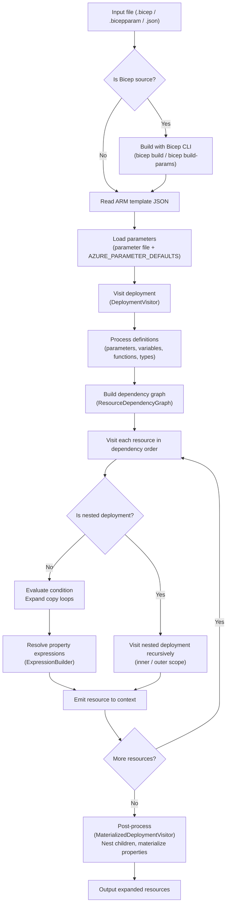

# Expansion internals

Expansion is the process of converting an Azure Resource Manager (ARM) deployment into a set of resources that
represent the desired state of the deployment.
This is the magic that allows PSRule for Azure to evaluate Infrastructure as Code (IaC) files using Bicep and ARM templates,
aka _pre-flight_.

Once the resources are expanded they can easily be evaluated similar to if they were deployed to Azure.
PSRule rules run against the expanded resources, allowing them to be evaluated in the same way as if they were deployed.

PSRule for Azure also supports _in-flight_ evaluation, which effectively exports the resources from Azure to a file.
Once exported, the resource are evaluated the same as expanded resources.

!!! Note
    The following sections describe the internals of the expansion process and how it works.
    It is intended for developers and contributors to the project, or anyone interested in how the expansion process works.
    It is not intended for end users, as it is not necessary to understand how expansion works to use PSRule for Azure.

## Overview

The expansion process is a multi-step process that involves several components.
The main components of the expansion process are:

- **Build** &mdash; If the source file is a Bicep module or parameter file it is built into an ARM deployment.
- **Deserialize and load parameters** &mdash; The ARM deployment JSON is deserialized and any parameters are loaded.
- **Walk the deployment** &mdash; The ARM deployment structure is navigated to find all resources and their properties
  by visiting each resource in turn.
  This can be broken into:
  - **Definitions** &mdash; Parameters, variables, functions, and types all have definitions that are used to build the deployment.
    These definitions are not resources, but they are used to build the resources.
  - **Resources** &mdash; Each resource in the deployment is evaluated in dependency order.
    During the evaluation process properties are inspected for encoded expressions until all properties are resolved.
  - **Nested deployments** &mdash; Deployments are also resources that can be nested in a parent deployment.
  - **Outputs** &mdash; The outputs of the deployment are also expanded.
  - **Materialized properties** &mdash; Some resources types have properties that are affected by multiple deployments or
    child resources. These must be calculated to determine the final state value of the property.

### High-level flow

The following diagram shows the high-level flow of the expansion process from source file to expanded resources.

### Key components

The key source code components involved in the expansion process are:

!!! Implementation
    | Component | Source file | Description |
    |-----------|-------------|-------------|
    | `BicepHelper` | `src/PSRule.Rules.Azure/Data/Bicep/BicepHelper.cs` | Invokes the Bicep CLI and coordinates expansion of Bicep and ARM files. |
    | `DeploymentVisitor` | `src/PSRule.Rules.Azure/Arm/Deployments/DeploymentVisitor.cs` | The core visitor that walks the ARM deployment structure. |
    | `MaterializedDeploymentVisitor` | `src/PSRule.Rules.Azure/Arm/Deployments/MaterializedDeploymentVisitor.cs` | Extends `DeploymentVisitor` to handle post-processing of emitted resources. |
    | `ResourceDependencyGraph` | `src/PSRule.Rules.Azure/Arm/Deployments/ResourceDependencyGraph.cs` | Builds and resolves the dependency graph for resources in a deployment. |
    | `ExpressionBuilder` | `src/PSRule.Rules.Azure/Arm/Expressions/ExpressionBuilder.cs` | Parses and evaluates ARM template expressions. |
    | `Functions` | `src/PSRule.Rules.Azure/Arm/Expressions/Functions.cs` | Implementations of ARM template built-in functions used during expression evaluation. |

## Building Bicep

Azure Bicep code syntax is a domain specific language provides a higher level of abstraction over ARM deployments.
It provides many high level features that make it much easier to author and maintain ARM deployments as code.
Bicep modules also allow for reusable components to be created in separate files that can be shared across multiple deployments.

PSRule for Azure uses the Bicep CLI to build Bicep files into ARM deployments represented as JSON.
As a result, the Bicep CLI must be installed and available prior to running the expansion process.

To build a Bicep file, the Bicep CLI is invoked with `bicep build` or `bicep build-params` command.

!!! Implementation
    The `BicepHelper` class (`src/PSRule.Rules.Azure/Data/Bicep/BicepHelper.cs`) is responsible for:

    - Discovering the Bicep CLI.
    - Spawning the Bicep CLI process.
    - Calling `ProcessFile` for a `.bicep` file or `ProcessParamFile` for a `.bicepparam` file.
    - Passing the resulting ARM template JSON to the deployment visitor for expansion.

### CLI discovery

To find an instance of the Bicep CLI, PSRule for Azure probes several paths, and uses the first instance found.
The following paths are probed in order:

- `PSRULE_AZURE_BICEP_PATH` &mdash; If this environment variable is set, it is used as the full file path to the Bicep CLI.
- `PSRULE_AZURE_BICEP_USE_AZURE_CLI` &mdash; If this environment variable is set to `true`, the Azure CLI is used.
  The Azure CLI must be installed and available in a location in specified in the `PATH` environment variable.
  PSRule for Azure will use the `az bicep build` or `az bicep build-params` command to build Bicep files.
- `PATH` &mdash; The Bicep CLI is searched for in the system `PATH` environment variable.
  If the Bicep CLI is installed and available in a location in specified in the `PATH` environment variable, it is used.

If the Bicep CLI is not found, an error is reported and the expansion process fails.

## Loading parameters

Parameters that are stored outside of the deployment must be loaded into the deployment before expansion can occur.
This occur in the following case:

- An ARM template parameter file is used with a Bicep deployment or ARM template.
- A Bicep parameter file is used with a Bicep deployment.

In additional to these cases,
default parameter values may also be loaded from the `AZURE_PARAMETER_DEFAULTS` configuration value.

This configuration value allows parameter values that are not specified in the parameter file to be set to a default value.
The main use case for this is to add parameters that would normally be specified as CLI/ PowerShell parameters to the deployment.
Secrets are a good example of this, as they should not be specified in the parameter file and checked into source control.

!!! Security
    When configuring `AZURE_PARAMETER_DEFAULTS`, use placeholders for the secret values instead of the actual values.
    Placeholders are sufficient for the expansion process, and the actual values can be provided at runtime during a
    CI/CD pipeline loaded from a secure location.

## Visiting definitions

Definitions are the building blocks of the ARM deployment and may be reference by resources or other definitions.
For most cases, definitions are lazy loaded into the context of the deployment during expansion.

!!! Implementation
    The `LazyParameter`, `LazyVariable`, and `LazyOutput` classes (in `src/PSRule.Rules.Azure/Arm/Deployments/`) implement this lazy loading pattern,
    deferring evaluation of each definition until it is first referenced.

Exceptions to this are when copy loops are used to define variables and parameters.
Otherwise the definitions are not resolved until they are referenced by a resource.

## Ordering resources by dependency

The ARM deployment is a directed acyclic graph (DAG) of resources and their dependencies.
In many deployments, the configuration of one resource depends on the configuration of another resource.
For example, a virtual machine depends on the resource ID of a virtual network subnet.
Similarly, a deployment may return outputs that are used in the parent deployment or as parameters to another deployment.

As a result, each resource must be visited based on a dependency graph so that dependencies are resolved
before dependant resources.

!!! Implementation
    The `ResourceDependencyGraph` class (`src/PSRule.Rules.Azure/Arm/Deployments/ResourceDependencyGraph.cs`) builds this graph
    from the `dependsOn` properties declared in the template, and performs a topological sort to produce the correct visit order.

## Visiting each resource

When a resource is visited:

- Conditions are evaluated to determine if the resource would be deployed, and skipped if not.
- Copy loops are evaluated to determine how many copies of the resource are needed.
  This is done by evaluating the copy loop and determining the number of iterations.
  The copy loop is then expanded into multiple resources, each with a unique name.
- Each property is evaluated and any encoded expressions are resolved to their final values.

Nested deployments are also resources however they are handled separately because they maintain their own context.

Once the all properties are resolved:

- Null properties are removed from the resource.
- Additional runtime properties are added (projected) onto the resource.
  These runtime properties are not defined in the original resource code but are assumed to be present in the resource.
  Often these properties can not be set in code because they are automatically set by Azure.
  If cases when the property can be set in code, these common use properties will be set to a value matching the ARM default.
- The resource is emitted to a list of resources as the result of the deployment.
  The resource IDs and names are also indexed so they can be referenced by other resources.

Once all resources in a deployment are emitted, A final pass at each resource is made to:

- Nest child resources under their parent resource if one exists in the deployment.
- Resolve any materialized properties that are affected by multiple deployments or child resources.
  This is done by evaluating the property and determining the final value based on the values of the child resources.

## Evaluating expressions

ARM supports a rich set of functions that can be used to set properties based on a wide variety of conditions.
Each of these expression must be evaluated to determine the final value of a resource property.

When an expression is found, it is parsed into an expression tree of nested function calls and their arguments.
This allows the expression to be evaluated by calling each function recursively and return a result.
For each function to be understood by the expansion process, it must be implemented in the PSRule for Azure code base.

When an expression is called, context about the deployment is passed into the root function of the expression.

!!! Implementation
    The key classes for expression evaluation are:

    - `ExpressionParser` (`src/PSRule.Rules.Azure/Arm/Expressions/ExpressionParser.cs`) &mdash;
      Tokenizes and parses ARM expression strings into an `ExpressionStream`.
    - `ExpressionBuilder` (`src/PSRule.Rules.Azure/Arm/Expressions/ExpressionBuilder.cs`) &mdash;
      Builds a callable expression tree from the parsed tokens.
    - `Functions` (`src/PSRule.Rules.Azure/Arm/Expressions/Functions.cs`) &mdash;
      Contains implementations of all supported ARM template built-in functions.

### Context properties

During deployment to Azure, ARM maintains several context objects that are used to evaluate expressions.
Similarly, PSRule uses non-environment specific context objects during expansion as these functions are evaluated locally.
For example, the `subscription().subscriptionId` expression returns the subscription ID of the current deployment.

PSRule for Azure allows the default context objects to be overridden by the user so that they provide,
a closer representation of their Azure environment.

### Mocked properties

The value for some properties is not known until the resource is deployed to Azure.
Where these properties are used in an expression,
they must be evaluated to a value that is an approximation of the final value.
Additionally for secrets the value is intentionally unknown.

PSRule for Azure uses several mocking techniques to allow the expansion process to continue when
suitable values can not be projected or materialized onto the resource.
